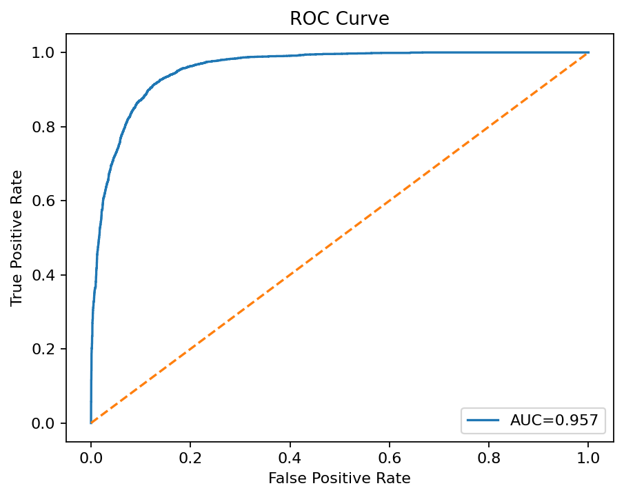
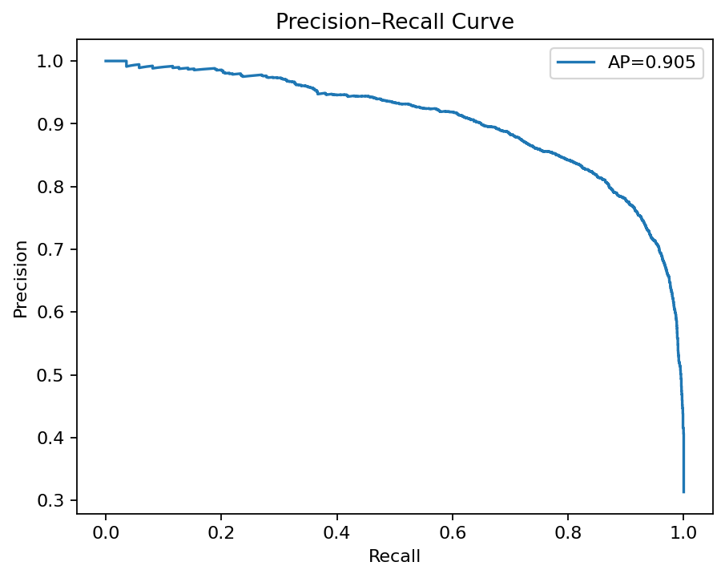
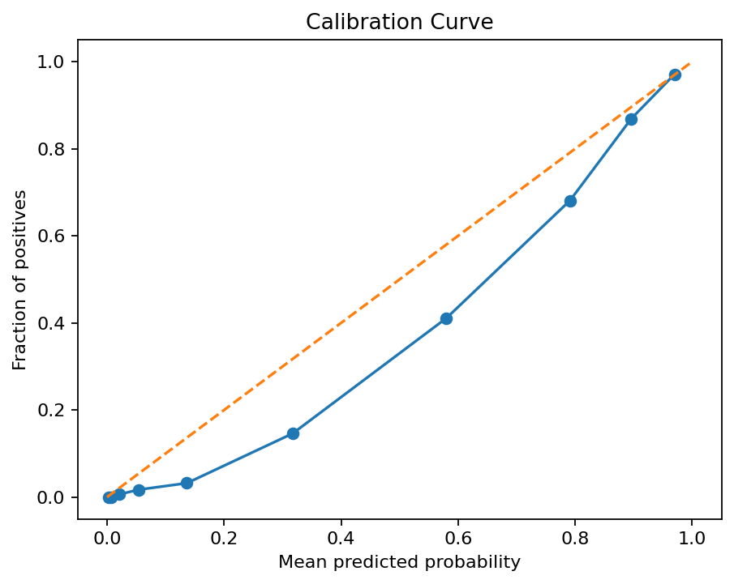

# Insurance Risk Model (XGBoost + KaggleHub)

This project builds a **binary classifier** to predict insurance risk using the **Car Insurance dataset** from Kaggle.  
The model is trained with **XGBoost**, and the dataset is fetched automatically via **KaggleHub** (no manual download required).

---

## 🚀 Quick Start

```bash
# 1. (Recommended) create and activate a virtual environment
python -m venv .venv

# Windows
.\.venv\Scripts\Activate.ps1

# macOS/Linux
source .venv/bin/activate

# 2. Install dependencies
pip install -r requirements.txt

# 3. Train model with XGBoost
make train_kaggle_xgb

# 4. Evaluate classification performance
make eval_kaggle

# 5. Generate visualizations (ROC, PR, calibration, confusion matrix, feature importance, lift/gain)
make viz_kaggle

# 6. Run predictions on the first 5 rows
python src/predict_xgb.py

---

##Results



